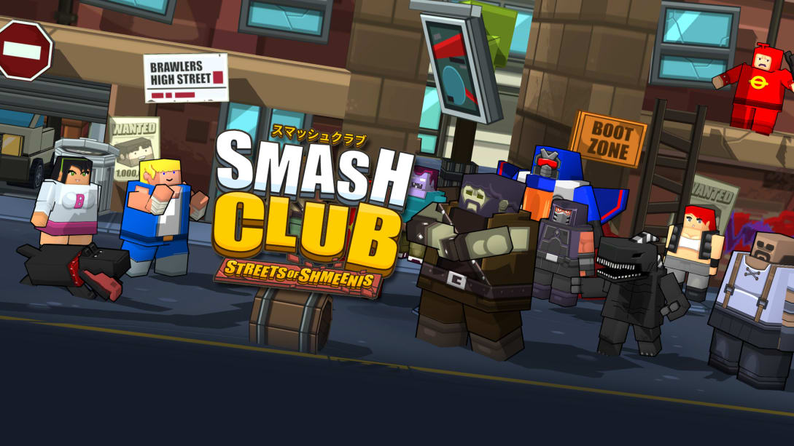
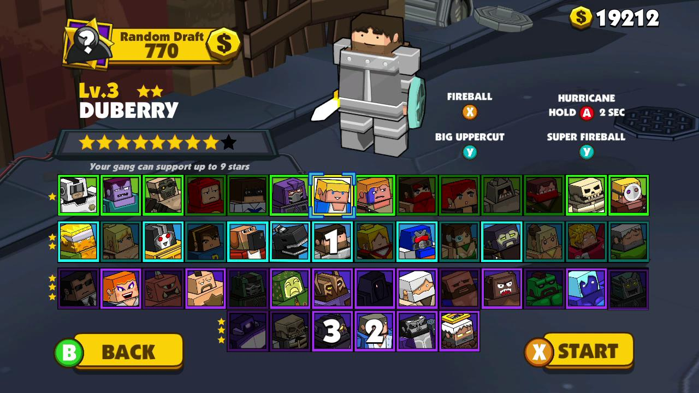
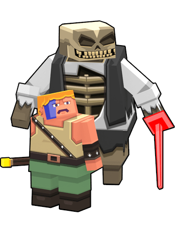

# SmashClub
Nintendo Switch eShop version have no advertisement and comes with premium upgrade and many playable characters already unlocked. 
Mobile version is free to download and play, but contains advertisement and in app purchases.

https://www.nintendo.com/games/detail/smash-club-streets-of-shmeenis-switch/

Bug tracker and Wiki for game SmashClub

Wiki with FAQ

https://github.com/FourFats/SmashClub/wiki

Report bugs and issues

https://github.com/FourFats/SmashClub/issues

Contact us for Wiki Collaborator access

https://www.fourfats.com/contact

Website

https://www.fourfats.com/

